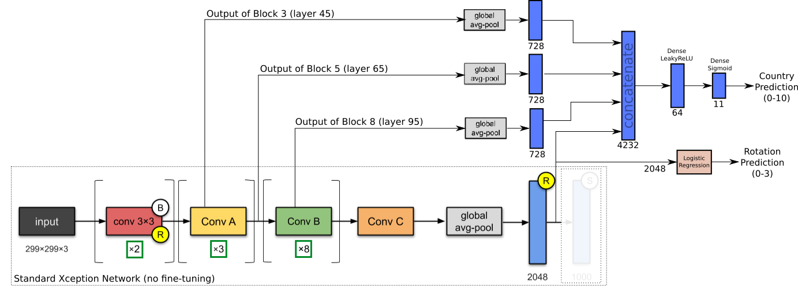

# TopTal Data Science Project
### Author: Alan Reiner
### Date: Feb 13, 2020

__TASK__: Given 714 images of chuches and temples in 11 different countries, train a classifier to try to predict the country from the image.

__Challenges__: 
1. Some images are rotated in increments of 90 degrees
2. Some images are landscape, some are portrait.  Resizing to standard size (299,299) will result in dramatically different stretching of key features.
3. Different aspect ratios and sizes
4. __Very few__ training examples for some countries.  Armenia has only 11!  Many countries have between 30 and 60 examples
5. Too much data to load into memory all at once for training

__Implemented Strategies__:
7. __Generators to Load Images from Disk During Training__: We don't pull all the images into memory because it's a ton of data.  Instead we created a tf.data.Dataset from a generator that reads the images from disk on-the-fly.  This is relatively slow, but likely necessary depending on the training environment.
1. __Augmentations__:  See `load_and_preprocess_data.ipynb`.  Every time an image is loaded from disk, it goes through a randomized set of augmentations, including random cropping, shearing, zooming, channel shift, horizontal flipping.
2. __Adjusted Sampling Rates__: Customize sampling rates from each country proportional to sqrt(N).  For instance, Russia has 11x as many images as Armenia, but will be sampled approximately 3.4x the rate of Armenia.
3. __Imbalanced Sample/Class Weights__: Increase the training weights of classes with few samples (Armenia, Australia).  Combined with increased sampling rates, this means Armenia contributes almost as much to the batch/epoch loss as the countries with lots of images.
4. __Transfer Learning from Pretrained Network__:  We use Xception pre-trained network, which has excellent imagenet performance and relatively small (20M parameters).  When you remove the top layer (1000 outputs), it emits a 10x10x2048 output for each image.  Use GlobalAvgPooling to produce a simple output of 2048 outputs.
5. __Add Intermediate Layer Outputs__:  In addition to using the standard 2048-output of Xception, we grab the outputs from multiple intermediate layer.  We need high-frequency image components since most pictures and even building structures are very similar, varying only by small deviations in shapes.  This is a similar technique as is used in style-transfer applications.
8. __K-fold Cross-Validation__: Because there are so few images for some classes, it's just not possible to get reasonable performance metrics (such as Armenia with 11 images).  If we do k-fold cross-validation, we can at least get some idea on all 11 images (at the expense of training 5 models for each test)
5. __Fine-Tuning (SKIPPED)__:  Intended to do some fine-tuning on the final model
6. __Triple Loss Training (SKIPPED)__: This is likely a good strategy to try, since this task has similarities to face recognition -- small images per class, subtle differences between images from different classes.

__Final Architecture__:

