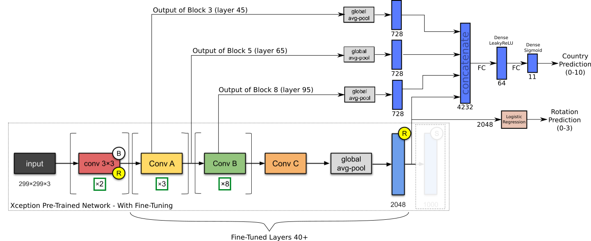
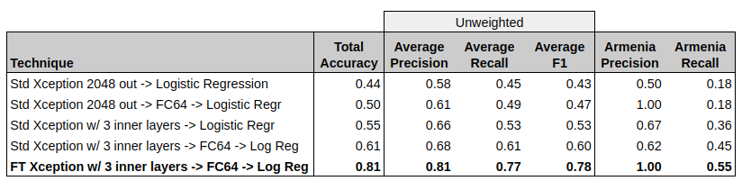
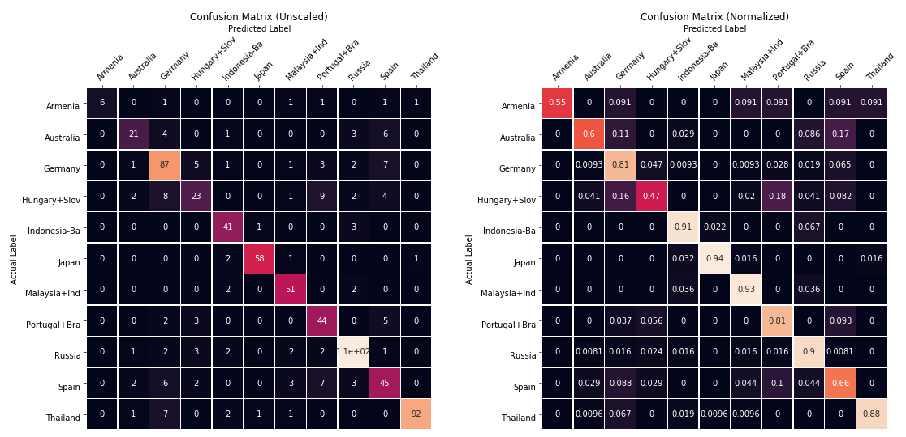
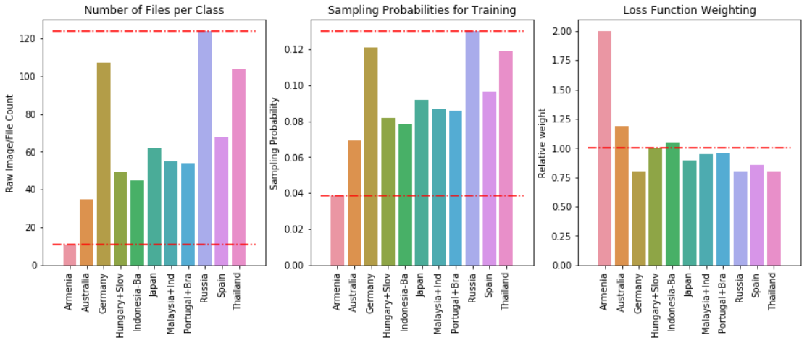
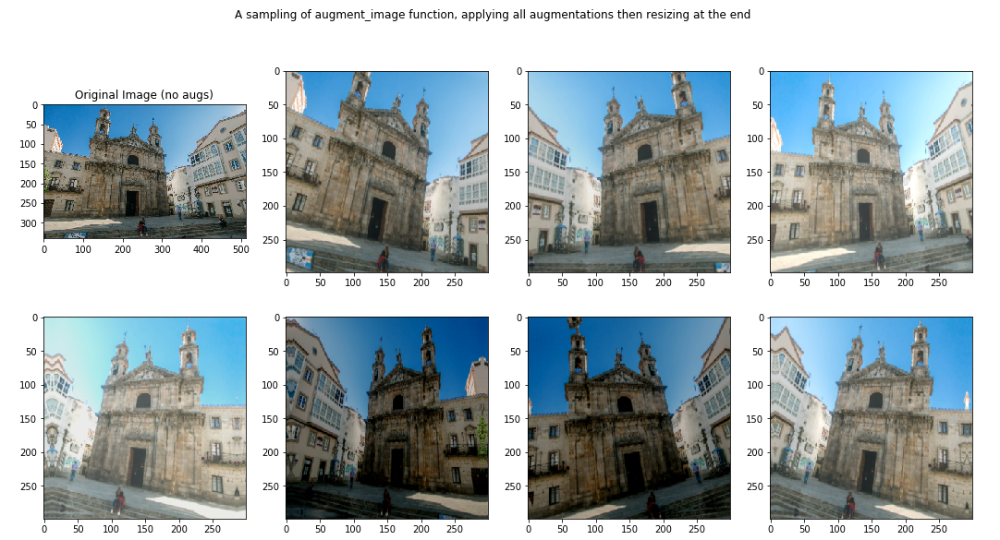

## TopTal Data Science Project
__Author__: Alan Reiner 

__Date__: Feb 13, 2020

### TASK

Given 714 images of chuches and temples in 11 different countries, train a classifier to try to predict the country from the image.

## Final Architecture

The final architecture is a fine-tuned Xception network, with three early-middle intermediate layers added to the output.  Given the limited size of the training dataset, we used only a 64-node hidden layer between that and the final logistic regression layer (fully-connected, dense layer with sigmoid activation).




## Final Results

Here's a summary of model performance for a few different configurations, including the final configuration as shown above (FT~Fine-Tuned):



We put special emphasis on Armenia because there's only 11 images totals, which means that it is at risk of being ignored by the classifier.  As we can see, we achieve 100% precision and 55% recall with our final model, which is probably not much worse than a human would be able to do with the limited dataset.

Here's the full confusion matrices (unscaled and scaled):



And the scikit-learn classification report of the results from 5-fold cross-validation:

```
                  precision    recall  f1-score   support
  
         Armenia       1.00      0.55      0.71        11
       Australia       0.75      0.60      0.67        35
         Germany       0.74      0.81      0.78       107
  Hungary+Slovak       0.64      0.47      0.54        49
  Indonesia-Bali       0.80      0.91      0.85        45
           Japan       0.97      0.94      0.95        62
  Malaysia+Indon       0.84      0.93      0.88        55
  Portugal+Brazi       0.67      0.81      0.73        54
          Russia       0.88      0.90      0.89       124
           Spain       0.65      0.66      0.66        68
        Thailand       0.98      0.88      0.93       104
  
        accuracy                           0.81       714
       macro avg       0.81      0.77      0.78       714
    weighted avg       0.81      0.81      0.81       714
```

## __Implemented Strategies__:

1. __Generators to Load Images from Disk During Training__: Created a tf.data.Dataset from a generator that reads the images from disk on-the-fly.  This is relatively slow, but likely necessary depending on the training hardware.
3. __Adjusted Sampling Rates__: Customize sampling rates from each country proportional to sqrt(N).  For instance, Russia has 11x as many images as Armenia, but will be sampled approximately 3.4x the rate of Armenia.
4. __Imbalanced Sample/Class Weights__: Increase the training weights of classes with few samples (Armenia, Australia).  Combined with sampling rate adj, Armenia contributes almost as much to the (average) batch loss as the countries with lots of images.
2. __Image Augmentations__:  Every time an image is loaded from disk, it goes through a randomized set of augmentations, including random cropping, shearing, zooming, channel shift, horizontal flipping.  See `load_and_preprocess_data.ipynb`.
5. __Transfer Learning from Pretrained Network__:  We use Xception pre-trained network, which has excellent imagenet performance and relatively small (20M parameters).  When you remove the top layer (1000 outputs), it produces a 10x10x2048 output for each image.  Use GlobalAvgPooling to produce a simple output of 2048 outputs.
6. __Add Intermediate Layer Outputs__:  In addition to the std 2048-output of Xception, we grab the outputs from multiple intermediate layer.  We need high-frequency image components since most pictures and even building structures are very similar, varying only by small deviations in shapes.  This is a similar technique as is used in style-transfer applications.
8. __Fine-Tuning__:  Fine-Tuning was critical because the Xception network was trained for a much different classification task than ours.  Adding intermediate layers made a huge difference in results, but trained with convolution kernels appropriate for a different domain.
7. __K-fold Cross-Validation__: Because there are so few images for some classes, it's just not possible to get reasonable performance metrics (such as Armenia with 11 images).  If we do k-fold cross-validation, we can at least get some idea on all 11 images (at the expense of training 5 models for each test)
8. __Label Smoothing__: Because you should pretty much always do it for neural net classifiers...
9. __(SKIPPED) Triple Loss Training__: This is likely a good strategy to try, since this task has similarities to face recognition -- small image count per class, subtle differences between images from different classes.

## __Accommodating Imbalanced Sample Sizes__:

We accomodate the high imbalance in two phases.  First, training is done purely via sampling from the training set (with on-the-fly augmentation).  We adjust the sampling rates by $\sqrt{N}$, to make sure the countries with fewer images are sampled more frequently.  Second, we apply class weights during training proportional to $\frac{1}{\sqrt{N}}$ to also increase the weights of these minority classes.

* Russia has 11.3x times as many images as Armenia
* Russia is sampled only 3.4x times as often as Armenia 
* Losses from Russia images are multiplied by 0.8, while Armenia images are 2.1



## __Image Augmentations__:

Every time an image is loaded for training, it is read directly from disk and passed through the methods in `image_utilities.py`, which add five randomized augmentations.  The parameters of the augmentations are randomized each time, and the *order* of the augmentations is also randomized.  At the end the images are resized to the target shape, `(299, 299, 3)`.  The five augmentations are:
1. __Random Cropping__:  We crop the longest dimension somewhere between perfect square and no cropping.  If there is cropping, it's has a randomized offset from the top (portrait) or left (landscape) edge of the image
2. __Shear__:  Using tf.keras.preprocessing.image, we apply up to a +/- 15 deg shearing to each image
3. __Zoom__:  Using tf.keras.preprocessing.image, we apply up to a +/- 10% zoom to the image.  The range is small because cropping is also removing part of the image, don't want to lose too much
4. __Channel Shift__:  Using tf.keras.preprocessing.image, a random channel shift, +/- 25%
5. __Rotation__:  Using tf.keras.preprocessing.image, a random image rotation +/- 15 deg, with `reflect` for filling empty pixels





