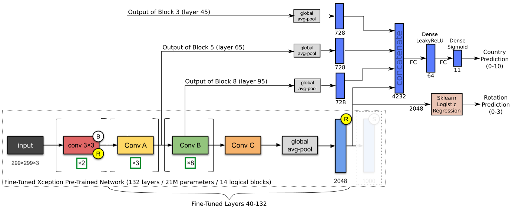
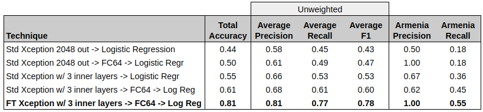
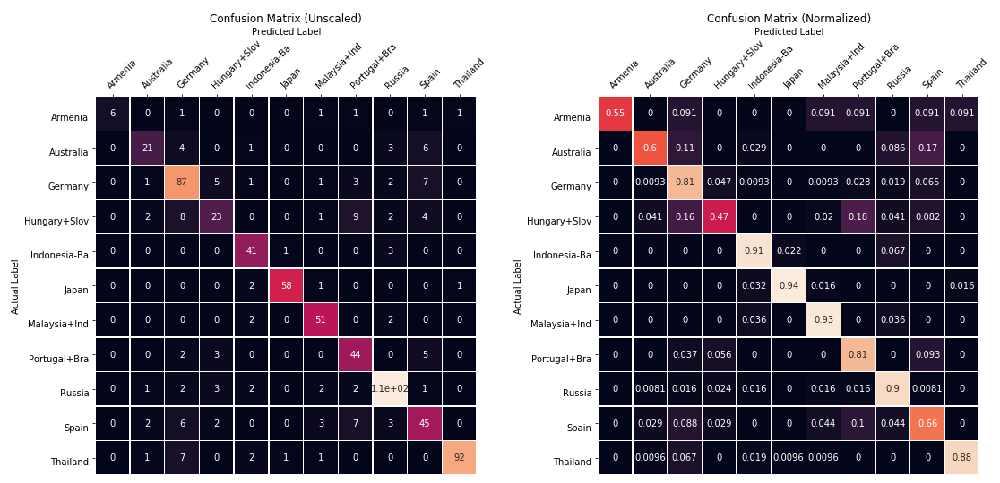
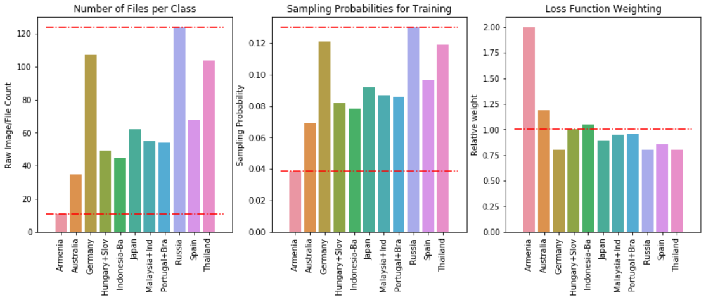
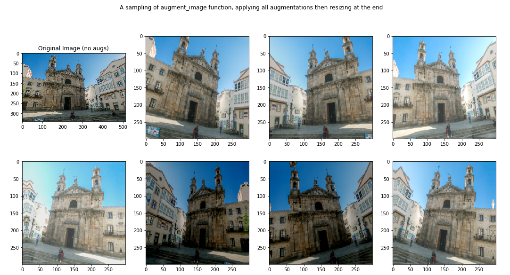

## TopTal Data Science Project
__Author__: Alan Reiner 

__Date__: Feb 13, 2020

### TASK

Given 714 images of chuches and temples in 11 different countries, train a classifier to try to predict the country from the image.

Instructions to run the model are at the end of this `README.md`.

## Final Architecture

The final architecture is a fine-tuned Xception network, with three early-middle intermediate layers added to the output.  Given the limited size of the training dataset, only a 64-node hidden layer was used between that and the final logistic regression layer (fully-connected, dense layer with sigmoid activation).



## Final Results

Here's a summary of model performance for a few different configurations, including the final configuration as shown above (FT~Fine-Tuned):



Special emphasis  was put on Armenia because there's only 11 images totals, which means that it is at risk of being ignored by the classifier.  It can be seen the result is 100% precision and 55% recall with the final classifier.  This is actually far better than originally expected, and even humans probably couldn't do much better given the limited datasets.

Although overall accuracy is not a great metric for imbalanced classification problems, it's highly correlated with good results.  We can see that, using the Xception network:

* Base performance on standard Xception outputs: **~45%** accuracy
* Adding an extra FC layer to Xception output:   **+ 5%** accuracy
* Adding intermediate layers from Xception net:  **+ 10%** accuracy
* Fine-Tuning Xception after initial training:   **+ 20%** accuracy 

Thus, the final accuracy with all three design features is approximately ~80%.

Here's the full confusion matrices (unscaled and scaled):



And the scikit-learn classification report of the results from 5-fold cross-validation:

```
                  precision    recall  f1-score   support
  
         Armenia       1.00      0.55      0.71        11
       Australia       0.75      0.60      0.67        35
         Germany       0.74      0.81      0.78       107
  Hungary+Slovak       0.64      0.47      0.54        49
  Indonesia-Bali       0.80      0.91      0.85        45
           Japan       0.97      0.94      0.95        62
  Malaysia+Indon       0.84      0.93      0.88        55
  Portugal+Brazi       0.67      0.81      0.73        54
          Russia       0.88      0.90      0.89       124
           Spain       0.65      0.66      0.66        68
        Thailand       0.98      0.88      0.93       104
  
        accuracy                           0.81       714
       macro avg       0.81      0.77      0.78       714
    weighted avg       0.81      0.81      0.81       714
```

## __Implemented Strategies__:

1. __Rotation Correction__:  Implemented a logistic regression classifier using the standard outputs of the Xception pre-trained network.  It correctly identifies images rotated in increments of 90 deg, with 99.5% accuracy.  Input images are evaluated by this model, and inverse rotation is applied (if necessary) before it is run through the main classification network.
2. __Image Augmentations__:  Every time an image is loaded from disk, it goes through a randomized set of augmentations, including random cropping, shearing, zooming, channel shift, horizontal flipping.  See `load_and_preprocess_data.ipynb`.
3. __Adjusted Sampling Rates & Class/Sample Weights__: Adjust sampling rates from each country proportional to sqrt(N) to increase relative frequency of sampling of countries with fewer images.  Similarly, class/sample weights are applied during training to more-heavily weight these minority class samples.  Together, this strategy nearly equalizes the contribution of minority classes samples with those of the majority classes, to the loss optimization.
5. __Transfer Learning from Pretrained Network__:  Use Xception pre-trained network, which has excellent imagenet performance and relatively small (20M parameters).  When you remove the top layer (1000 outputs), it produces a 10x10x2048 output for each image.  Use GlobalAvgPooling to produce a simple output of 2048 outputs.
6. __Add Intermediate Layer Outputs__:  In addition to the std 2048-output of Xception, the outputs from multiple intermediate layers are used.  Need high-frequency image components since most pictures and even building structures are very similar, varying only by small deviations in shapes.  This is a similar technique as is used in style-transfer applications.
8. __Fine-Tuning__:  Fine-Tuning was way more effective than I expected even though I know The Xception network was trained on a significantly different domain. 
7. __K-fold Cross-Validation__: Because there are so few images for some classes, it's just not possible to get reasonable performance metrics (such as Armenia with 11 images).  By doing k-fold cross-validation, we can get some idea of classifier performance on all 11 images (at the expense of training 5 models for each test)
1. __Generators to Load Images from Disk During Training__: Created a tf.data.Dataset from a generator that reads the images from disk on-the-fly.  This is relatively slow, but likely necessary depending on the training hardware.
8. __Label Smoothing__: Because you should pretty much always do it for neural net classifiers...

Something that would've been attempted if more time was available (and less satisfying results from the above strategies):

1. __(SKIPPED) Triple Loss Training__: This is likely a good strategy to try, since this task has similarities to face recognition -- small image count per class, subtle differences between images from different classes.

## __Accommodating Imbalanced Sample Sizes__:

Class imbalance is addressed in two ways:

1. Training is done purely via sampling from the training set (with on-the-fly augmentation).  Sampling rates are adjusted by $\sqrt{N}$, which increases the sampling rate of countries with low images counts, relative to the other classes. 
2. Class/sample weights are used in training, proportional to $\frac{1}{\sqrt{N}}$ to also increase the weights of these minority classes.

The end

* Russia has 11.3x times as many images as Armenia
* Russia is sampled only 3.4x times as often as Armenia 
* Losses from Russia images are multiplied by 0.8, while Armenia images are 2.1



## __Image Augmentations__:

Every time an image is loaded for training, it is read directly from disk and passed through the methods in `image_utilities.py`, which add five randomized augmentations.  The parameters of the augmentations are randomized each time, and the *order* of the augmentations is also randomized.  At the end the images are resized to the target shape, `(299, 299, 3)`.  The five augmentations are:
1. __Random Cropping__:  We crop the longest dimension somewhere between perfect square and no cropping.  If there is cropping, it's has a randomized offset from the top (portrait) or left (landscape) edge of the image
2. __Shear__:  Using tf.keras.preprocessing.image, we apply up to a +/- 15 deg shearing to each image
3. __Zoom__:  Using tf.keras.preprocessing.image, we apply up to a +/- 10% zoom to the image.  The range is small because cropping is also removing part of the image, don't want to lose too much
4. __Channel Shift__:  Using tf.keras.preprocessing.image, a random channel shift, +/- 25%
5. __Rotation__:  Using tf.keras.preprocessing.image, a random image rotation +/- 15 deg, with `reflect` for filling empty pixels





# Setting Up the Environment

The following environment was used for all training and execution:

1. Python 3.7.2
2. Tensorflow(-GPU) 2.1
3. Numpy 1.18.1
3. Matplotlib 3.1.2
4. Sklearn 0.22
5. NVIDIA GTX 970 with CUDA 10.1

The requirements.txt file contains all the packages that were installed for both training and inference.  To use it, simply create a fresh virtual environment, and then install the packages.

```
$ python3 -m venv areiner_proj_env
$ source areiner_proj_env/bin/activate
$ pip install --upgrade pip
$ pip install -r requirements.txt
```

With the environment in place, you can run the model with one command on the desired directory.  **NOTE: Two model files are required to run the model for inference, both of which will be downloaded the first time you run the script (~300MB).** After the first run, it will use the local files instead of downloading again.

```
$ python final_model.py <IMG_DIR>
```

When you are done, you can deactivate the virtual env and delete it:

```
$ deactivate
$ rm -rf areiner_proj_env
```

It will print the output .csv filename when it is done.  Alternatively, you run the model using the `ApplyFinalClassifier.ipynb` notebook, which will also display some extra info.


